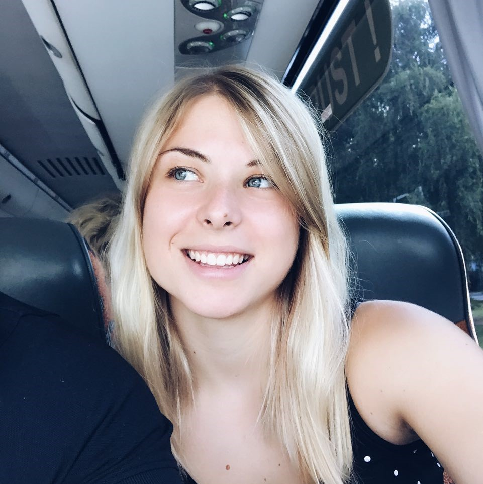

## About Me

 

* Name: **Danijela Vrzan**
* Discord Server Nickname: **TS: Danijela**
* Current Location: **Toronto, Canada**
* Home Country: **Croatia**

***

### Programming Experience

I am often sad and disappointed that I did not come into contact with programming at all until 2015, after I finished University. I graduated as a Bachelor of Civil Engineering in Zagreb, Croatia, where I am originally from. Working in that field of engineering made me realise that I didn't really like it and it wasn't what I originally expected it to be.

Nonetheless, I was very lucky to have been introduced to the IT world by my hubby, who is a Project Manager. He got tired of listening to me talking how I dislike working in CE and told me to go and try any online course on programming that I find interesting. 

My first course was in HTML, CSS, and some JavaScript, and me being me I instantly loved the way I got to create a simple website and design it. I am in no way a designer, but a very creative person which you will probably see in my homework assignments. I love to design assets, but I love the coding more.

I got back to school and finished my second University and got a Bachelor's Degree in Computer Science in Rijeka, Croatia, in September 2019. I learned some basics about computers, logic, IT in general, and programming. I wanted to build software for mobile phones, specifically iPhones because I could build something for myself. Mobile Development wasn't covered in my courses so I decided to learn it myself. Having finished CS, only helped me a little bit in understanding the basics of Swift and iOS Development. I still feel like I learned more myself in 6 months then during those 3 years. 

I moved to Toronto, Canada, right after I finished my studies and have since been learning about Swift and iOS Development. I fell in love with it and am enjoying on spending every minute I can in developing apps and learning development concepts. 

And here I am... Attending iOS bootcamp and taking the steps forward to become a Junior iOS Developer!

### Hobbies

In my free time I love to put my mind on ease and play some video games to relax and in the same time spend some time with my friends. I also read books sometimes. I mostly enjoy science-fiction and fantasy. I am a great fan of Harry Potter, The Witcher, and the whole LOTR lore.
Apart from that, I love to experiment with cooking different food, go to the gym, sketch, and spend time outside exploring Toronto's amazing restaurants! 

 

## iOS Bootcamp Curriculum

### Week 01 
#### Course
[Your first iOS and UIKit app](https://www.raywenderlich.com/5993-your-first-ios-and-uikit-app)
#### Homework
[Week 01 homework solution](https://github.com/dvrzan/santas-elf/tree/master/Week01)
***
### Week 02
#### Course
[Programming in Swift: Fundamentals](https://www.raywenderlich.com/5993-your-first-ios-and-uikit-app)
#### Homework
[Week 02 homework solution](https://github.com/dvrzan/santas-elf/tree/master/Week02)
***
### Week 03
#### Course
[Programming in Swift: Functions and Types](https://www.raywenderlich.com/5993-your-first-ios-and-uikit-app)
#### Homework
[Week 03 homework solution](https://github.com/dvrzan/santas-elf/tree/master/Week03)
***
### Week 04
#### Course
[Beginning iOS Debugging](https://www.raywenderlich.com/4681-beginning-ios-debugging) 
[Layout in iOS](https://www.raywenderlich.com/6849561-layout-in-ios) 
[Unit and UI Testing](https://www.raywenderlich.com/960290-ios-unit-testing-and-ui-testing-tutorial) 
#### Homework
[Week 04 homework solution](https://github.com/dvrzan/santas-elf/tree/master/Week04)
***
### Week 05
#### Course
[Beginning Table Views](https://www.raywenderlich.com/5995-beginning-table-views)
#### Homework
[Week 05 homework solution](https://github.com/dvrzan/santas-elf/tree/master/Week05)
***
### Week 06
#### Course
[Beginning Collection Views](https://www.raywenderlich.com/5429927-beginning-collection-views)
#### Homework
[Week 06 homework solution](https://github.com/dvrzan/santas-elf/tree/master/Week06)
***
### Week 07
#### Course
[Your First iOS and SwiftUI app](https://www.raywenderlich.com/4919757-your-first-ios-and-swiftui-app) 
[Your Second iOS and SwiftUI app](https://www.raywenderlich.com/5662524-your-second-ios-and-swiftui-app) 
[SwiftUI](https://www.raywenderlich.com/4001741-swiftui) 
#### Homework
[Week 07 homework solution](https://github.com/dvrzan/santas-elf/tree/master/Week07)
***
### Week 08
#### Course
[Beginning Core Data](https://www.raywenderlich.com/7104-beginning-core-data) 
[Saving Data in iOS](https://www.raywenderlich.com/5429634-saving-data-in-ios) 
#### Homework
[Week 08 homework solution](https://github.com/dvrzan/santas-elf/tree/master/Week08)
***
### Week 09
#### Course
[Networking with URLSession](https://www.raywenderlich.com/10376245-networking-with-urlsession) 
[Fundamental iOS Design Patterns](https://www.raywenderlich.com/1941154-fundamental-ios-design-patterns#c-rate) 
#### Homework
[Week 09 homework solution](https://github.com/dvrzan/santas-elf/tree/master/Week09)
***

 
   

