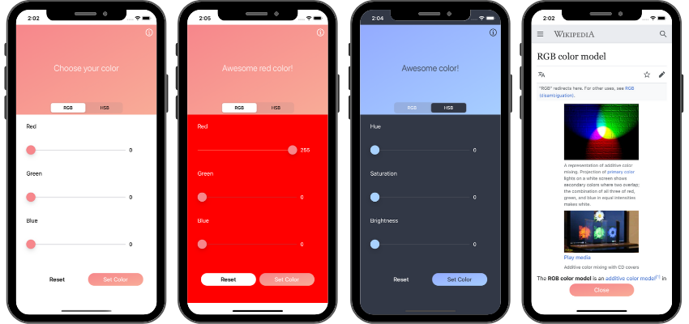

## About the app

### Color Picker

Color Picker is an app that lets you create your own color using **RGB** (Red, Green, Blue) or **HSB** (Hue, Saturation, Brightness) color models. Set the RGB or HSB slider's values to whatever values you want then press the Set Color button to name your new color and see what color you created!

If you don't like what you see, press the Reset button and try again!

### Want to learn more about the RGB color model?

Check the wikipedia page from inside your app to learn more about the RGB color model.

## Concepts learned

 
   

