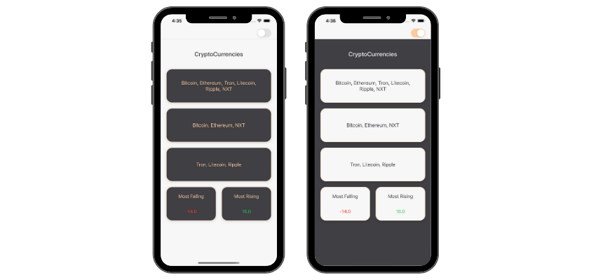

## About the app

### Criptly

Criptly is an app that parses all cryptocurrencies from a json file inside the app bundle and shows them on a screen simulating widget-like view. 
The first view lists all the cryptocurrencies from the file.
The second view lists all the cryptocurrencies whose current value has increased from it's previous value.
The third view lists all the cryptocurrencies whose current value has decreased from it's previous value.

The last two views are showing currencies' values that have been rising or falling the most.

## Concepts learned

 
   

