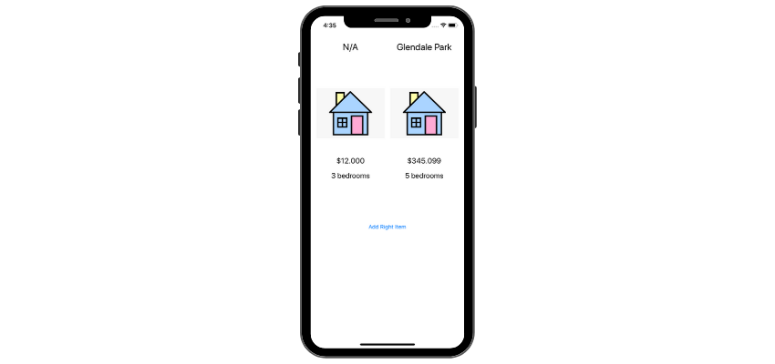

## About the app

### Comparison Shopper

Comparison shopper is an app that showcases 2 houses side by side so user can compare them and decided which one to buy. 

### Xcode Debugging

The app came with 2 bugs. Find and fix the bugs using Xcode Debugger and LLVM.

 

1. **Fatal error: Unexpectedly found nil while unwrapping an Optional value: file /…/ViewController.swift, line 38**
- Breakpoint on line 38
    - Shows nil value for all labels in the function
    - Step Into -> Shows nothing useful
- I found that IBOutlet for roomLabelLeft was not hooked-up. Fixed that.
- Looking at how a struct that represented the model was initialised, I saw that it wasn’t.
    - house1 variable did not contain any information about it’s properties, it was always nil.
    - Struct collection gives up a free initialiser and therefore there was no error regarding it, all values were always nil, except when I added default values inside setUpLeftSideUI() function
- **Initialising the house1 fixed the bug!**
- *Added default values inside viewDidLoad() in case no values were provided at initialisation*

2. **No visible errors, but when I press OK button inside AlertController when adding new house2, no label shows - like they are empty.**
- Breakpoint on line 77
    - Step Over -> Shows house2 as nil when present(alert…) is called
- Breakpoint on line 78 (Entering info inside text fields and pressing OK in the app)
    - Shows house properties as nil, because they were just initialised
    - Step Over, line 79 -> Everything is still nil
    - Step Over, line 80 -> address gets updated
    - Step Over, line 81 -> price gets updated
    - Step Over, line 82 -> bedrooms get updated
    - All properties are not nil
    - Line 83, Step Into inside setUpRightSideUI -> Shows labels not nil
    - Step Into, line 44 -> Goes to else statement, because values are not nil
- Looking at the function I see the alpha value of the labels were set to 0 if house2 == nil but were never set to 1 again, so the values weren’t nil and the labels got updated but were unseen because their alpha was set to 0.
- **Setting the alpha back to 1 when house2 != nil fixed the bug!**
- *Added default values if properties of house2 were nil*

 
   

