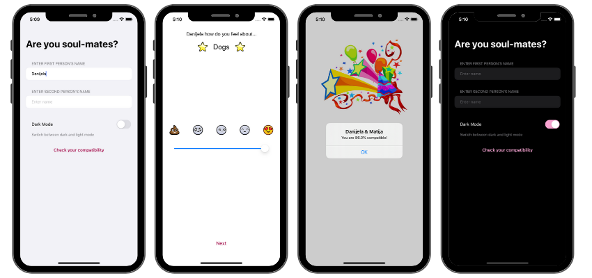

## About the app

### Compatibly

Compatibly is a simple dating app that calculates compatibility percentage between 2 people by rating different items. Users move the slider depending on how they feel about a given item. Each person rates the same items and after they are finished the result is presented.

Extra feature is added for the users to enter their names at the start of the app.
The app also features an instant dark mode switch that remembers the style preference the next time user enters the app.

 
   

