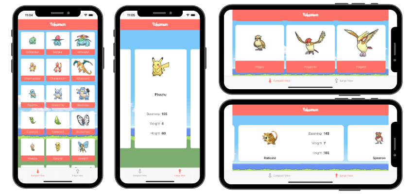

## About the app

### PokeDex

PokeDex is a simple app that shows a collection view of different pokemons - their pictures, names, base experience, weight, and height. Vertical and horizontal collection views in this app are utilizing newest framework features and using Diffable Data Sources and Data snapshots to layout the view.

App consists of 2 views; compact view in vertical layout that shows basic info, and large view in horizontal layout that shows more detailed information. Landscape mode is also configured using Vary For Traits.

< /br>

