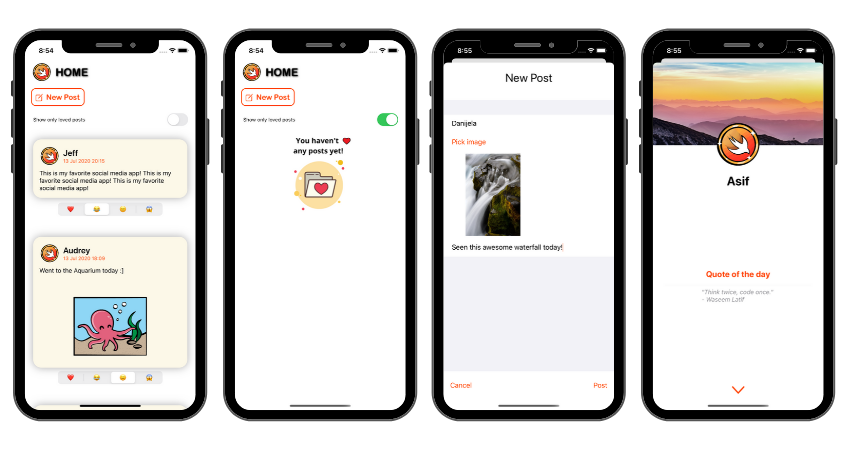
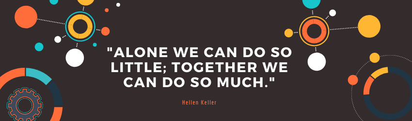

## About the app

### BirdUI

BirdUI is a remake of Birdie, a twitter-like app, built completely in SwiftUI.

It features a home page screen as a list of posts. Users can add new posts, add reactions to existing ones, and filter by loved posts. 

Selecting a post brings the profile screen that shows user's avatar, name, and a randomly generated quote of the day.

## Concepts learned

> Developed by Danijela & Asif as part of RayWenderlich iOS bootcamp's teamwork assignment.

 

