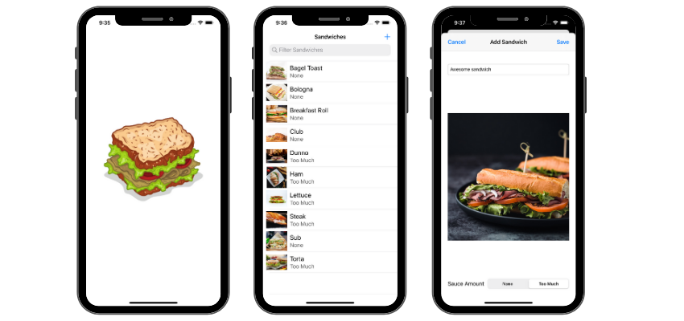

## About the app

### SandwichSaturation

Sandwich Saturation is an app that shows a list of sandwiches, their names, images, and amount of sauce they have. Sandwich images are added randomly. 
User can add a new sandwich, choose it's name and sauce amount. 
Data is persisted using CoreData and UserDefaults.
When running the app for the first time, user gets presented with a preloaded set of sandwiches (seed data) read from a json file.
Users can also delete sandwiches.

### The Requirements Video
The following clip, *[courtesy of WWDC 2020](https://twitter.com/CastIrony/status/1275496089060167680)*, provides some guidance on acceptance criteria for this application. This is only a 12 second clip, but it's very important!

### Packaging seed data

**Describe at least one other option for packaging seed data with an app. Which do you think makes the most sense if you were shipping SandwichSaturation, and why?**

- If SandwichSaturation had bigger dataset it would be good to use preloaded SQLite database so that changes could be made easily and the data is loaded faster. Some apps give users, when the app is run for the first time, an option to choose the initial (or seed) data to load. Like when choosing what categories you like and then load data according to those categories. I think a good idea is to have the database in the FileManager for faster loading, or even from the external API to load the most current data if fetching from the internet.

 

