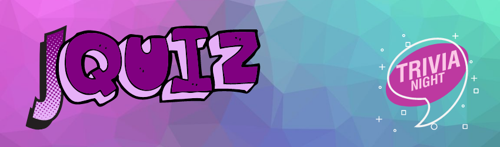

## About the app

### jQuiz

jQuiz is a simple app featuring Jeopardy-like quiz that fetches data from *[http://www.jservice.io/ API](http://www.jservice.io)*. It utilizes completion handlers to execute two network calls one after another, waiting for the first one to finish. It gets a random category from random endpoint and then fetches all non-nil value clues for that category. The network call returns only 4 clues. The question for the category is closen randomly from the array of those 4 returned clues. 

If a user answers correctly to the question, the value of the clue returned from the json will be added to the score and the next clue will be fetched. In case of a wrong answer, no points will be awarded and the next clue will be presented.

One feature of the app is for the user to choose to play a theme song for the quiz and the sound preference gets saved for the next time the app is run using UserDefaults.

The header logo image is downloaded from the URL the first time the user opens the app and gets cached.

## Concepts learned

 

