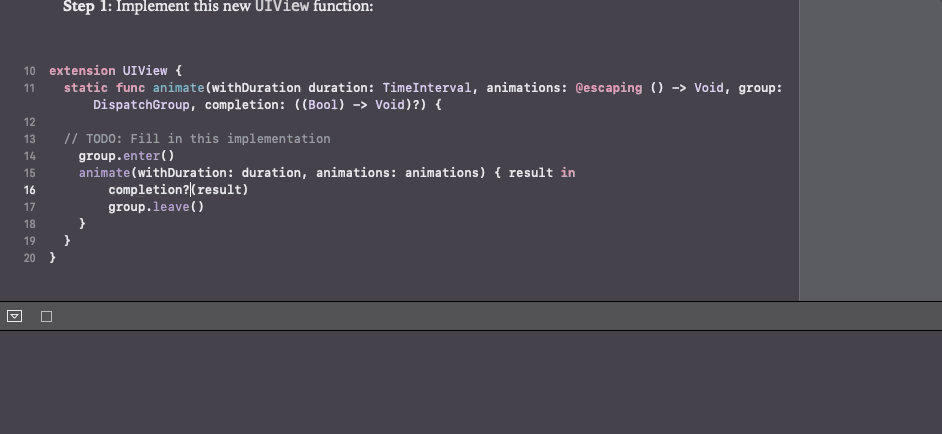
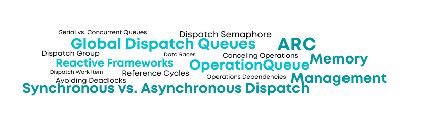
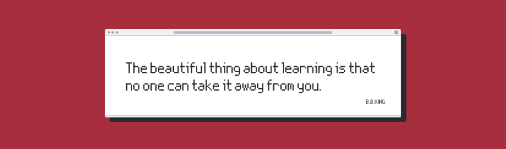

## About the app

  

### PLAYGROUND: Concurrent Animations

TASK: Your task is to extend **UIView** to add a **DispatchGroup** argument to
*animate(withDuration:animations:completion:)* , then use the dispatch group to make the
**Animations Completed!** message appear after the animations finish.

Use **animationGroup** and your new animate function to rewrite the animation so you're notified
when all the sub-animations finish.

## Concepts learned

 

